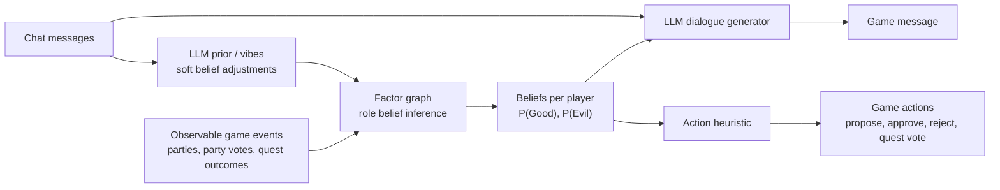
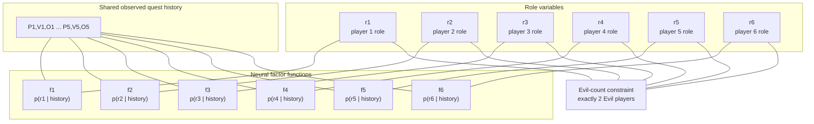
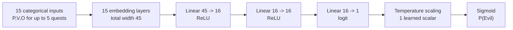
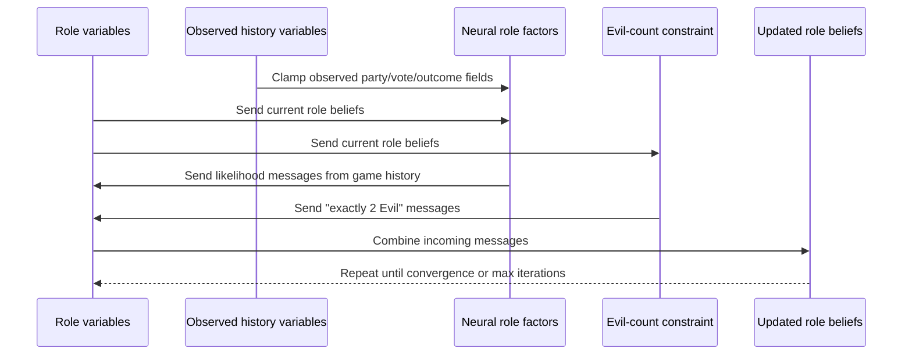
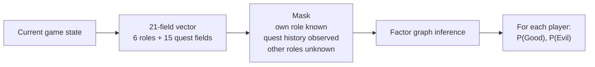
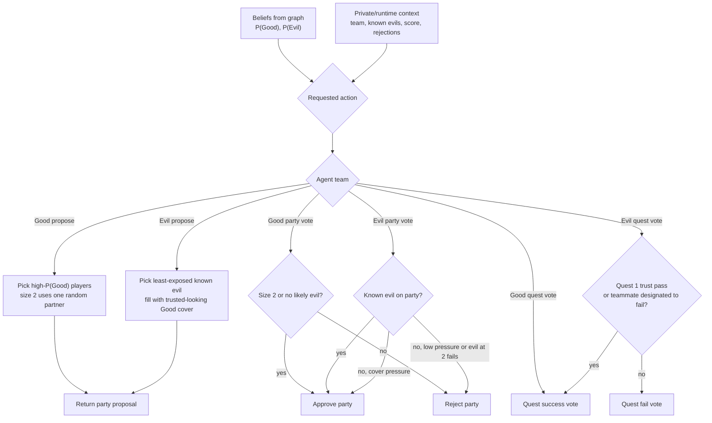
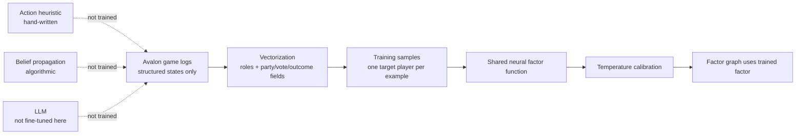
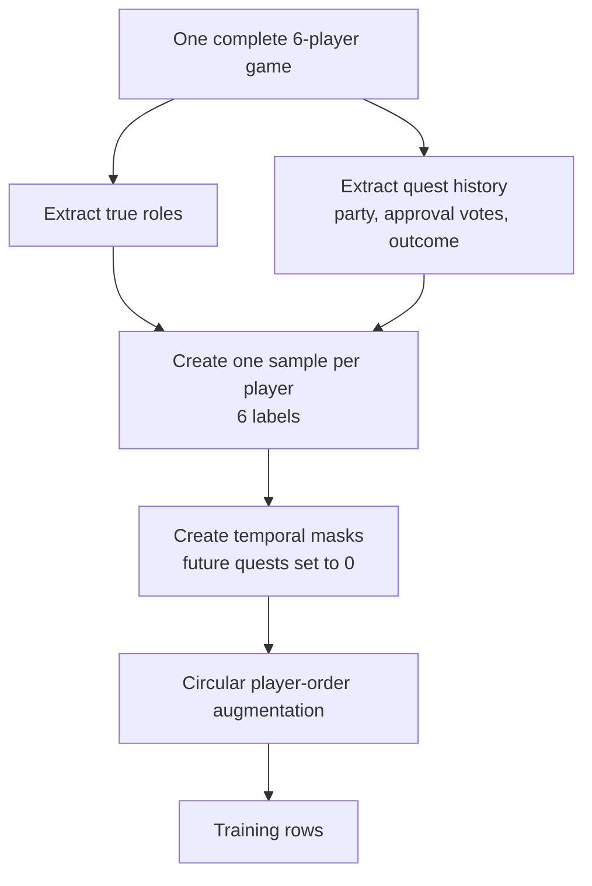

# Beginner Guide to GRAIL, the Factor Graph, and the Training Data

This document explains the GRAIL agent in beginner-friendly terms. It focuses on
the parts that are easy to confuse:

- the factor graph is not itself a normal neural network;
- the factor graph contains small neural factor functions;
- only those neural factor functions are trained on the game-log dataset;
- the action policy is a separate hand-written heuristic;
- the training dataset contains structured game states, not chat language.

Useful source files:

- `code/agent/agent_acl.py`: main GRAIL agent wrapper.
- `code/agent/our/model_reduced_categories.py`: factor graph construction.
- `code/agent/our/pomegranate/factor_graph.py`: belief propagation inference.
- `code/agent/our/pomegranate/distributions/egocentric_neuralnet.py`: neural factor function.
- `code/agent/our/policy_models/heuristic.py`: action heuristic.
- `code/agent/our/training/`: dataset vectorization and training code.

External references:

- Project page: <https://camp-lab-purdue.github.io/bayesian-social-deduction/>
- Dataset card: <https://huggingface.co/datasets/shahabrahimirad/bayesian-social-deduction>
- Paper: <https://arxiv.org/abs/2506.17788>

## One-Screen Summary

GRAIL is a hybrid agent with three main parts:

1. A factor graph that tracks beliefs over who is Good or Evil.
2. An LLM that turns those beliefs plus chat history into natural-language messages.
3. A hand-written action heuristic that proposes teams and votes using the graph's beliefs.



The graph is responsible for structured belief tracking. The LLM is responsible
for language. The heuristic is responsible for concrete game actions.

## What Is the Factor Graph?

A factor graph is a probabilistic model. It has two kinds of nodes:

- variable nodes, which represent unknown or observed quantities;
- factor nodes, which assign probabilities to combinations of variable values.

In this project, the most important unknowns are the six role variables:

```text
r1, r2, r3, r4, r5, r6
```

Each role variable is binary:

```text
0 = Good
1 = Evil
```

The graph also contains observed game-history variables for each quest:

```text
Pi = accepted party composition for quest i
Vi = approval-vote composition for quest i
Oi = quest outcome for quest i
```

For five quests, that gives 15 game-history variables:

```text
P1, V1, O1, P2, V2, O2, P3, V3, O3, P4, V4, O4, P5, V5, O5
```

So the current implementation is built around this 21-field vector:

```text
[r1, r2, r3, r4, r5, r6,
 P1, V1, O1, P2, V2, O2, P3, V3, O3, P4, V4, O4, P5, V5, O5]
```

Unknown future quest fields are encoded as zeroes.

## Is the Factor Graph a Feedforward Neural Network?

No.

The factor graph is a probabilistic graphical model that runs belief propagation.
It is not a vanilla feedforward neural network.

However, each player-role factor is approximated by a small feedforward neural
network. The paper calls this "factor function approximation." A traditional
factor table would be too large, so the project uses a neural network to estimate
the conditional probability:

```text
p(rj | P1, V1, O1, ..., P5, V5, O5)
```

Read this as:

```text
What is the probability that player j is Evil or Good,
given the observable quest history?
```

## The Six Neural Factor Nodes

There are six role variables and six corresponding neural factor nodes:



In the implementation, these factors use a shared egocentric neural network.
That means the model does not train six unrelated networks. Instead, it reorders
the input so that the player currently being evaluated is placed in the "ego"
position, then applies the same learned factor function.

This helps reduce positional bias. Without this, the model might accidentally
learn patterns tied to seat number instead of game evidence.

## Neural Factor Network Size

The current default architecture is very small:



Approximate parameter count:

| Component | Parameters |
| --- | ---: |
| Categorical embeddings | 835 |
| Linear 45 -> 16 | 736 |
| Linear 16 -> 16 | 272 |
| Linear 16 -> 1 | 17 |
| Base neural factor total | 1,860 |
| Temperature scaling | 1 |
| Calibrated total | 1,861 |

The output is a logit that becomes a probability through sigmoid. In practice,
the calibrated model applies temperature scaling before sigmoid so the model's
confidence better matches observed correctness.

## Belief Propagation: How the Graph Updates Beliefs

The graph uses message passing. Each variable sends its current belief to nearby
factors. Each factor sends back a new message based on its probability function
and messages from other variables. Repeating this process updates the marginal
beliefs for each player role.



The implementation can run either:

- `sum`: sum-product style inference;
- `max`: max-product style inference.

The current GRAIL agent calls prediction with `algorithm="max"` in
`agent_acl.py`.

## Inputs and Outputs at Runtime

At runtime, the agent builds a game-state vector from completed quest history.
The six role slots start unknown, except the agent knows its own role.



Example output shape:

```python
{
    1: {"good": 0.72, "evil": 0.28},
    2: {"good": 0.31, "evil": 0.69},
    3: {"good": 0.83, "evil": 0.17},
    4: {"good": 0.54, "evil": 0.46},
    5: {"good": 0.22, "evil": 0.78},
    6: {"good": 0.38, "evil": 0.62},
}
```

Those probabilities are beliefs, not ground truth.

## The Action Heuristic

The action heuristic is a hand-written policy, not a trained model. It lives in
`code/agent/our/policy_models/heuristic.py` and is wired into the full GRAIL
agent by `code/agent/agent_acl.py`.

The policy receives two kinds of information:

- graph beliefs: each player's current `P(Good)` and `P(Evil)`;
- private/runtime context: the agent's team, its own name, known evil teammate
  names, failed party-vote count, quest number, and current score.

Current Good-team behavior:

- propose the players with the highest probability of being Good;
- for parties of size 2, choose the highest-`P(Good)` player plus one random
  partner from the remaining ordered players;
- approve parties of size 2 automatically;
- otherwise reject a party if any member has `P(Evil) > P(Good)`;
- always vote success on quests.

Current Evil-team behavior:

- store known evil identities from private data, including self and evil
  teammate names, normalized to lowercase;
- propose a party with exactly one known evil when possible, choosing the known
  evil with the lowest `P(Evil)` as the least-exposed option;
- fill the rest of the proposal with the most trusted-looking Good players for
  cover;
- use `EVIL_BURNED_THRESHOLD = 0.7` only as the documented cutoff for when an
  evil player looks exposed. It does not allow the proposer to create an all-Good
  team when a known evil can be included;
- approve any party that contains a known evil;
- reject all-Good parties on Quest 2 or later when the rejection count is still
  low (`failed_party_votes <= 1`);
- approve all-Good parties under moderate rejection pressure
  (`failed_party_votes >= 3`) to preserve cover;
- reject all-Good parties when Evil already has 2 failed quests, because one
  more failed quest wins the game;
- still obey the outer agent's final-proposal safeguard: at
  `failed_party_votes >= 4`, `agent_acl.py` forces party approval to avoid the
  five-rejection game-ending path;
- vote success on Quest 1 when `PASS_FIRST_QUEST = True`, building trust on the
  first size-2 quest;
- when multiple known evil players are on the quest, only the lexicographically
  smallest evil name votes fail, so a quest usually receives exactly one fail;
- fail quests aggressively after Quest 1, when Evil has 2 failed quests, or when
  Good has 2 successful quests.



The policy is intentionally conservative and explicit. It is useful for the
simplified 6-player Servant/Minion setting, but it is not a learned deception
strategy and should be revisited if richer Avalon roles or variable player
counts are added.

## What Was Trained on the Dataset?

Only the neural conditional probability estimator inside the factor graph was
trained on the large Avalon game-log dataset.

Trained:

- the shared egocentric neural factor function;
- the post-hoc temperature calibration scalar.

Not trained on that dataset:

- the factor graph structure;
- the loopy belief propagation algorithm;
- the evil-count constraint;
- the action heuristic;
- the LLM weights.



## What Is the Training Dataset Composed Of?

The paper describes the factor-function training data as structured, non-language
Avalon game states from:

| Source | Games |
| --- | ---: |
| AvalonLogs | 3,143 |
| ProAvalon | 101,280 |
| Total | 104,423 |

The dataset is split into:

| Split | Share |
| --- | ---: |
| Train | 80% |
| Validation | 10% |
| Test | 10% |

The public Hugging Face dataset card also describes released game-log groups:

| Released group | Purpose |
| --- | --- |
| `agent_games` | AI-vs-AI games |
| `human_experiments` | human/agent experiment games |
| `model_ablation` | ablation games for model/configuration comparisons |

These logs include fields such as game state, quest number, turn number, failed
party votes, player role/team, agent type, messages, and proposed parties.

## How a Game Becomes Training Examples

Each complete game is converted into several examples.

First, each player becomes a target once:

```text
6 players -> 6 supervised samples
```

For a target player, the label is:

```text
0 = Good
1 = Evil
```

The input is the quest history:

```text
[P1,V1,O1, P2,V2,O2, P3,V3,O3, P4,V4,O4, P5,V5,O5]
```

Then the code creates partial-game versions by masking future quests with zeroes.



Example for a game that ends after three quests:

```text
[P1, V1, O1, 0,  0,  0,  0,  0,  0,  0, 0, 0, 0, 0, 0]
[P1, V1, O1, P2, V2, O2, 0,  0,  0,  0, 0, 0, 0, 0, 0]
[P1, V1, O1, P2, V2, O2, P3, V3, O3, 0, 0, 0, 0, 0, 0]
```

This prevents the model from learning from future information that the agent
would not actually know during a live game.

## Dataset Information That Is Not Used by the Factor Network

The released logs can contain language messages and agent metadata, but the
factor-function training described in the paper uses only game states without
language.

Not used as neural factor inputs:

- chat messages;
- LLM chain-of-thought or reasoning traces;
- player names as semantic text;
- natural-language accusations or defenses.

Used as neural factor inputs:

- accepted party composition;
- party approval vote composition;
- quest success/failure outcome;
- masking for unknown future quests;
- player-order transformations.

## Hallucination Detection Dataset

The hallucination-detection dataset mentioned in the appendix is separate from
factor-function training.

It was built from messages by Good agents across 40 ablation games. The authors
used LLMs to judge whether a message was potentially hallucinated, and selected a
prompting strategy by comparing against 100 human-annotated examples.

This data is for analyzing language reliability. It is not what trained the
factor graph's neural probability estimator.

## Why This Matters for Current Limitations

The architecture strongly reflects the simplified 6-player setting:

- role variables are hard-coded as six binary Good/Evil variables;
- the evil-count constraint is hard-coded for exactly two Evil players;
- party/vote categorical spaces are built around six players;
- the trained factor network expects exactly 15 quest-history categorical inputs;
- the action heuristic is Good-team oriented.

The simplest limitation to address is likely the action heuristic for Evil agents,
because it is hand-written policy code. The harder limitation is changing the game
size or adding richer Avalon roles, because that touches the graph structure,
categorical encodings, constraints, training data, and possibly model retraining.
